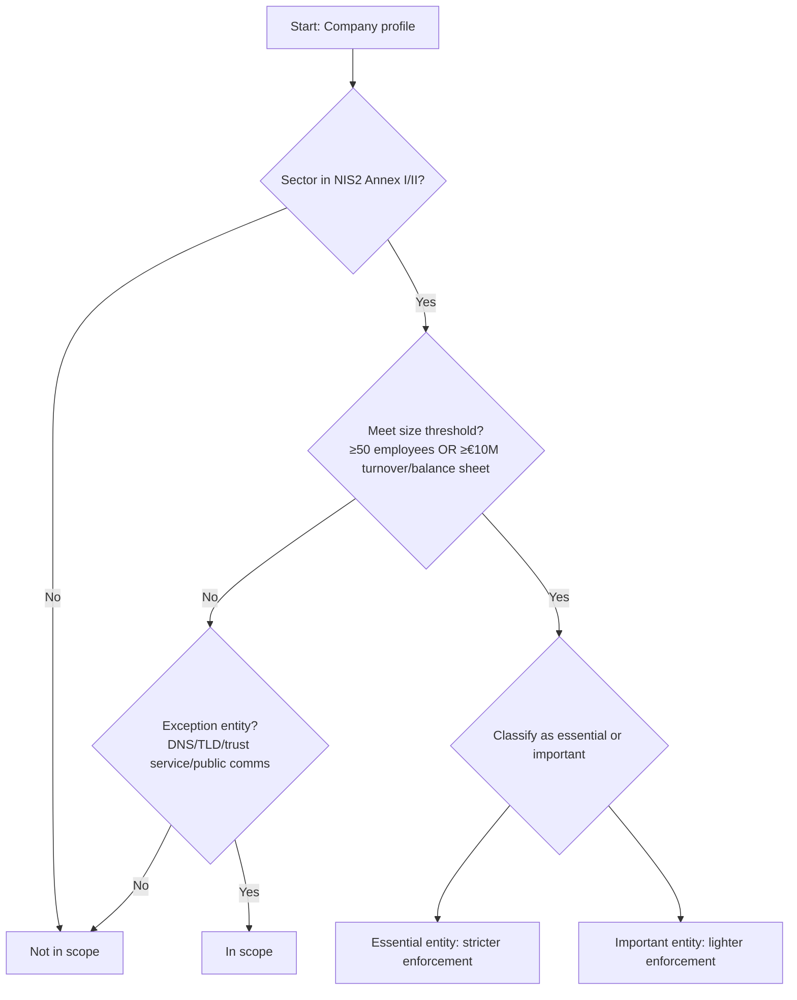
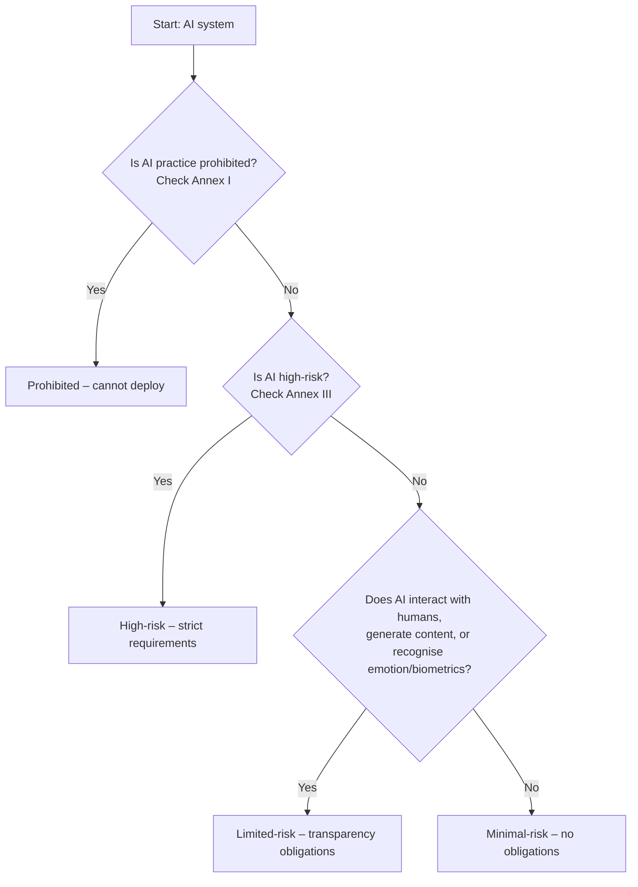

# CPLY-008: NIS2 & EU AI Act Applicability for Danish Startups (Gaming/Hosting Sector)

**Research ID:** CPLY-008
**Status:** Complete
**Last Updated:** 2026-04-13
**Scope:** NIS2 Directive and EU AI Act applicability criteria for Danish startups, focusing on gaming and hosting sectors. Determines exact thresholds (size, sector classifications), essential vs important entities, risk categories, SME exemptions, deployer/provider distinctions. Includes decision trees for coding into applicability logic.
**Regulation:** 
- NIS2: Directive (EU) 2022/2555 on measures for a high common level of cybersecurity (NIS2)
- EU AI Act: Regulation (EU) 2024/1689 laying down harmonised rules on artificial intelligence
- Danish transposition: Lov om foranstaltninger til sikring af et højt cybersikkerhedsniveau (implemented 2024), Erhvervsstyrelsen enforcement for AI Act.

---

## Executive Summary

The **NIS2 Directive** significantly expands EU cybersecurity obligations to medium and large entities in “essential” and “important” sectors. Danish startups in gaming and hosting may be in scope if they meet size thresholds (50+ employees OR €10M+ turnover) and operate in relevant sectors (digital infrastructure, ICT service management). **Essential entities** face stricter enforcement, while **important entities** have lighter enforcement but same obligations. **Personal liability** for management is a key feature.

The **EU AI Act** adopts a risk‑based approach: prohibited AI practices are banned outright; high‑risk AI systems are subject to strict requirements; limited‑risk systems have transparency obligations; minimal‑risk systems are largely unregulated. **SMEs and startups** benefit from certain exemptions (e.g., reduced fees, sandboxes) but are not exempt from substantive requirements. The Act distinguishes between **providers** (developers) and **deployers** (users) of AI systems, imposing different obligations.

For Danish gaming/hosting startups:
- **Hosting providers** often qualify as “digital infrastructure” under NIS2 (essential entity) if they operate data centres, cloud services, or CDNs.
- **Gaming companies** may fall under NIS2 if they operate online marketplaces (important entity) or if they provide critical gaming infrastructure.
- Both sectors frequently deploy AI (e.g., matchmaking, anti‑cheat, customer support) and must assess AI Act risk classification.

**Key takeaways:**
- NIS2 applies based on **sector + size**; gaming/hosting may be in scope.
- AI Act applies to **any AI system** placed on the EU market or used in the EU.
- Startups must map their activities to sector lists and assess AI risk level.
- Decision trees below enable automated applicability determination.

---

## 1. NIS2 Applicability Criteria

### 1.1 Legal Framework
- **Directive (EU) 2022/2555** (NIS2) entered into force 16 January 2023, transposition deadline 17 October 2024.
- **Danish transposition**: Implemented via sector‑specific legislation coordinated by CFCS (Center for Cybersikkerhed) under Forsvarsministeriet (Lov om foranstaltninger til sikring af et højt cybersikkerhedsniveau).
- **Enforcement authorities**: Sector‑specific (e.g., Energistyrelsen for energy, CFCS for digital infrastructure). Personal liability for management members.

### 1.2 Sector Classification
NIS2 divides entities into **essential entities** (stricter enforcement) and **important entities** (lighter enforcement). The sector lists are exhaustive.

**Essential entities (Annex I):**
1. **Energy** – electricity, district heating, oil, gas, hydrogen.
2. **Transport** – air, rail, water, road.
3. **Banking** – credit institutions.
4. **Financial market infrastructure** – trading venues, CCPs.
5. **Health** – hospitals, private clinics, medical devices, pharmaceutical R&D.
6. **Drinking water** – supply and distribution.
7. **Digital infrastructure** – IXPs, DNS service providers, TLD registries, cloud computing services, data‑centre services, content delivery networks (CDNs).
8. **ICT service management** – B2B managed service providers, managed security service providers.
9. **Public administration** – central and regional government.
10. **Space** – ground‑based infrastructure.

**Important entities (Annex II):**
1. **Postal and courier services**
2. **Waste management**
3. **Chemicals** – manufacturing, distribution.
4. **Food** – production, processing, distribution.
5. **Manufacturing** – medical devices, electronics, machinery, motor vehicles.
6. **Digital providers** – online marketplaces, online search engines, social‑networking services.
7. **Research organisations**

### 1.3 Size Thresholds
- **General rule**: Medium and large enterprises are in scope.
- **Medium enterprise**: ≥50 employees **OR** annual turnover ≥€10 million **and/or** annual balance sheet total ≥€10 million (based on EU SME definition).
- **Large enterprise**: ≥250 employees **OR** annual turnover ≥€50 million **and/or** annual balance sheet total ≥€43 million.
- **Exceptions**: Certain entities are in scope **regardless of size** (e.g., DNS service providers, TLD registries, qualified trust‑service providers, public electronic communications networks).
- **Micro and small enterprises** (<50 employees AND annual turnover <€10 million AND balance sheet total <€10 million) are generally **out of scope**, unless they fall under the exception list.

### 1.4 Gaming/Hosting Sector Mapping
- **Hosting providers** (cloud, data centres, CDNs) → **Digital infrastructure** (essential entity).
- **Gaming platforms** that operate an online marketplace for in‑game assets → **Digital providers** (important entity).
- **Gaming companies** that provide critical multiplayer infrastructure (e.g., matchmaking servers) could be considered “ICT service management” (essential) if B2B.
- **Gaming studios** developing games without operating infrastructure may be out of scope unless they exceed size thresholds and fall under “digital providers” (e.g., social‑networking features).

### 1.5 Key Obligations
1. **Risk‑management measures** (Art. 21) – policies, incident handling, business continuity, supply‑chain security, cryptography, access control, multi‑factor authentication.
2. **Incident reporting** (Art. 23) – early warning within 24h, notification within 72h, final report within 1 month.
3. **Management accountability** (Art. 20) – approval of cybersecurity measures, oversight, training, personal liability.
4. **Supply‑chain security** – assess risks of direct suppliers, include cybersecurity requirements in contracts.
5. **Registration** with relevant national authority.

### 1.6 Penalties
- **Essential entities**: Up to €10M or **2% of global annual turnover**, whichever higher.
- **Important entities**: Up to €7M or **1.4% of global annual turnover**, whichever higher.
- **Personal liability**: Management members can be fined, temporarily suspended, or named publicly.

---

## 2. EU AI Act Applicability Criteria

### 2.1 Legal Framework
- **Regulation (EU) 2024/1689** (AI Act) entered into force 1 August 2024.
- **Phased enforcement**:
  - **Prohibited practices**: 2 February 2025.
  - **High‑risk AI systems & GPAI**: 2 August 2026.
  - **Transparency obligations**: 2 August 2026.
  - **Full application**: 2 August 2027 (for AI systems already on the market).
- **Danish enforcement authority**: Erhvervsstyrelsen (Danish Business Authority) designated as national supervisory authority.

### 2.2 Risk‑Based Classification
AI systems are classified into four risk levels:

1. **Prohibited AI practices** (Annex I) – banned outright:
   - Subliminal manipulation causing harm.
   - Exploiting vulnerabilities of specific groups.
   - Social scoring by public authorities.
   - Real‑time remote biometric identification in publicly accessible spaces for law enforcement (with narrow exceptions).
   - Emotion recognition in workplace/education.
   - Predictive policing based solely on profiling.
   - Untargeted scraping of facial images for facial‑recognition databases.

2. **High‑risk AI systems** (Annex III) – subject to strict requirements:
   - **Safety components of products** subject to EU harmonisation legislation (e.g., medical devices, vehicles, machinery).
   - **Standalone AI systems** in eight areas:
     - Biometric identification and categorisation.
     - Critical infrastructure management.
     - Education and vocational training.
     - Employment, worker management, access to self‑employment.
     - Access to essential private and public services.
     - Law enforcement, migration, asylum, border control.
     - Administration of justice and democratic processes.
   - **GPAI** (General‑Purpose AI) with systemic risk.

3. **Limited‑risk AI systems** – transparency obligations:
   - AI systems that interact with humans (e.g., chatbots).
   - Emotion recognition.
   - Biometric categorisation.
   - AI‑generated/ manipulated content (deepfakes).
   - Must inform users they are interacting with AI.

4. **Minimal‑risk AI systems** – no specific obligations (e.g., AI‑enanced video games, spam filters).

### 2.3 SME & Startup Exemptions
- **SME definition**: Follows EU Recommendation 2003/361/EC:
  - **Medium**: <250 employees, ≤€50M turnover OR ≤€43M balance sheet total.
  - **Small**: <50 employees, ≤€10M turnover OR ≤€10M balance sheet total.
  - **Micro**: <10 employees, ≤€2M turnover OR ≤€2M balance sheet total.
- **Startups**: Not legally defined; generally considered newly created SMEs. May qualify for additional support.
- **Fee reductions** for SMEs and startups (e.g., conformity assessment fees).
- **Sandboxes** – controlled testing environments provided by national authorities (Denmark's sandbox expected via Erhvervsstyrelsen).
- **Simplified documentation** for certain high‑risk AI systems (technical documentation reduced).
- **No blanket exemption** – substantive requirements still apply (e.g., high‑risk AI must still undergo conformity assessment).
- **Support measures** – Member States must promote SME access to AI innovation (funding, testing facilities).
- **Proportionality principle** – enforcement authorities must consider SME size when imposing fines.

### 2.4 Provider vs Deployer Distinction
- **Provider**: Any natural or legal person that develops an AI system or has it developed and places it on the market or puts it into service under its own name or trademark.
  - Obligations: conformity assessment, technical documentation, CE marking, post‑market monitoring, etc.
- **Deployer**: Any natural or legal person using an AI system under its authority, except for personal non‑professional activities.
  - Obligations: human oversight, data governance, transparency to affected persons, etc.
- **Importers, distributors** have specific obligations in the supply chain.

### 2.5 Gaming/Hosting Sector Mapping
- **Gaming AI** (matchmaking, NPC behaviour, anti‑cheat) typically **minimal‑risk** unless it involves prohibited practices (e.g., emotion recognition for profiling).
- **Hosting AI** (resource optimization, security monitoring) may be **limited‑risk** (transparency) or **high‑risk** if used for critical infrastructure management (e.g., data‑centre cooling, power grid).
- **Chatbots** for customer support → **limited‑risk** (must disclose AI interaction).
- **AI‑generated content** (e.g., procedural game assets) → **limited‑risk** (must label as AI‑generated if likely to be mistaken for human‑created).

### 2.6 Penalties
- **Prohibited AI practices**: Up to €35M or **7% of global annual turnover**, whichever higher.
- **High‑risk AI violations**: Up to €15M or **3% of global annual turnover**, whichever higher.
- **Limited‑risk transparency violations**: Up to €7.5M or **1.5% of global annual turnover**, whichever higher.
- **Supply‑chain violations**: Up to €7.5M or **1.5% of global annual turnover**, whichever higher.
- **SMEs**: Fines may be reduced proportionally.

---

## 3. Decision Trees for Applicability Logic

### 3.1 NIS2 Applicability Decision Tree


**Code logic pseudocode:**
```
function isNIS2Applicable(company):
    // Size threshold: employees ≥50 OR turnover ≥€10M OR balance sheet total ≥€10M
    sizeThreshold = company.employees >= 50 OR 
                    company.turnover >= 10_000_000 OR 
                    company.balance_sheet_total >= 10_000_000
    
    if company.sector in NIS2_essential_sectors:
        if sizeThreshold:
            return {applicable: true, category: 'essential'}
    if company.sector in NIS2_important_sectors:
        if sizeThreshold:
            return {applicable: true, category: 'important'}
    if company.is_exception_entity:  // DNS, TLD, trust service, public comms
        return {applicable: true, category: 'essential'}
    return {applicable: false}
```

### 3.2 EU AI Act Risk Classification Decision Tree


**Code logic pseudocode:**
```
function classifyAIActRisk(aiSystem):
    if aiSystem.practice in prohibited_list:
        return {risk: 'prohibited', obligations: 'ban'}
    if aiSystem.purpose in high_risk_list:
        return {risk: 'high', obligations: 'conformity_assessment'}
    if aiSystem.has_transparency_trigger:  // human interaction, content generation, etc.
        return {risk: 'limited', obligations: 'transparency'}
    return {risk: 'minimal', obligations: 'none'}
```

### 3.3 Provider vs Deployer Determination
```
function determineAIStakeholder(company, aiSystem):
    if company.develops_ai AND (company.markets_under_own_name OR company.puts_into_service):
        return 'provider'
    else if company.uses_ai_under_authority AND not personal_non_professional:
        return 'deployer'
    else if company.imports_or_distributes_ai:
        return 'importer/distributor'
    else:
        return 'not_in_scope'
```

---

## 4. Actionable Checklist for Danish Startups

### Category 1: NIS2 Readiness
1. **Determine sector classification** – map your activities to NIS2 Annex I (essential) or Annex II (important).
2. **Assess size thresholds** – count employees (including part‑time equivalents) and calculate annual turnover/balance sheet.
3. **Register with authorities** – if in scope, register with CFCS or sector‑specific authority.
4. **Implement risk‑management measures** – adopt ISO 27001 or equivalent framework.
5. **Establish incident response plan** – ensure 24‑hour early‑warning capability.
6. **Train management** – ensure board members understand personal liability.
7. **Secure supply chain** – assess cybersecurity risks of critical suppliers.

### Category 2: EU AI Act Compliance
8. **Inventory AI systems** – list all AI tools used in development, hosting, gaming.
9. **Classify risk level** – apply Annex I/III criteria; document rationale.
10. **For high‑risk AI** – conduct conformity assessment, create technical documentation, affix CE marking.
11. **For limited‑risk AI** – implement transparency measures (e.g., “This is an AI chatbot”).
12. **Distinguish provider/deployer roles** – assign responsibilities accordingly.
13. **Monitor prohibited practices** – ensure no AI falls under banned categories.
14. **Leverage SME exemptions** – apply for fee reductions, participate in sandboxes.

### Category 3: Cross‑Cutting Actions
15. **Appoint compliance officer** – designate responsibility for NIS2/AI Act.
16. **Update contracts** – include cybersecurity and AI compliance clauses.
17. **Conduct annual review** – reassess applicability as company grows.
18. **Document everything** – maintain records for authority inspections.
19. **Stay informed** – follow CFCS and Erhvervsstyrelsen guidance updates.
20. **Seek legal advice** – consult with Danish compliance experts.

---

## 5. Sources & Further Reading

### NIS2
- **Directive (EU) 2022/2555 (NIS2)** – EUR‑Lex: https://eur-lex.europa.eu/eli/dir/2022/2555/oj
- **CFCS (Center for Cybersikkerhed)** – https://cfcs.dk/cybersikkerhed/nis2
- **European Commission NIS2 factsheet** – https://digital-strategy.ec.europa.eu/en/library/nis2-directive-eu-wide-cybersecurity-rules
- **Danish transposition law** – Lov om foranstaltninger til sikring af et højt cybersikkerhedsniveau (implemented 2024)

### EU AI Act
- **Regulation (EU) 2024/1689 (AI Act)** – EUR‑Lex: https://eur-lex.europa.eu/eli/reg/2024/1689/oj
- **European Commission AI Act portal** – https://digital-strategy.ec.europa.eu/en/policies/european-ai-act
- **Erhvervsstyrelsen AI Act guidance** – https://erhvervsstyrelsen.dk/ai-act (forthcoming)
- **Danish Business Authority (Erhvervsstyrelsen)** – https://erhvervsstyrelsen.dk

### Danish Context
- **Datatilsynet** (GDPR enforcement) – https://www.datatilsynet.dk
- **Erhvervsstyrelsen** (bookkeeping, AI Act) – https://erhvervsstyrelsen.dk
- **CFCS** (cybersecurity) – https://cfcs.dk

---

**Prepared by:** Hermes Agent (assigned to CPLY-008)
**Date:** 2026-04-13
**Next steps:** Integrate decision‑tree logic into EUComply AI classifier and generate applicability assessment workflows.