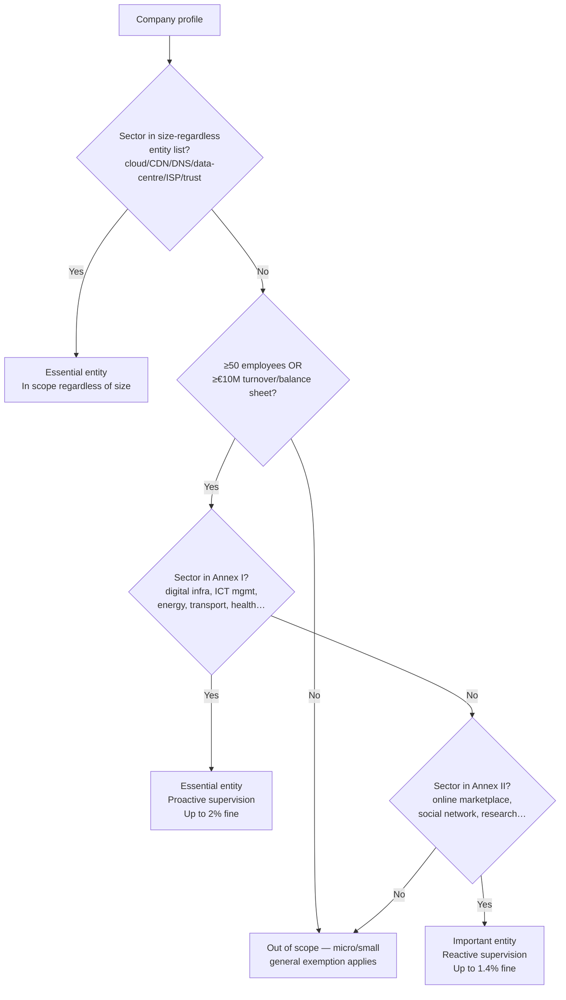
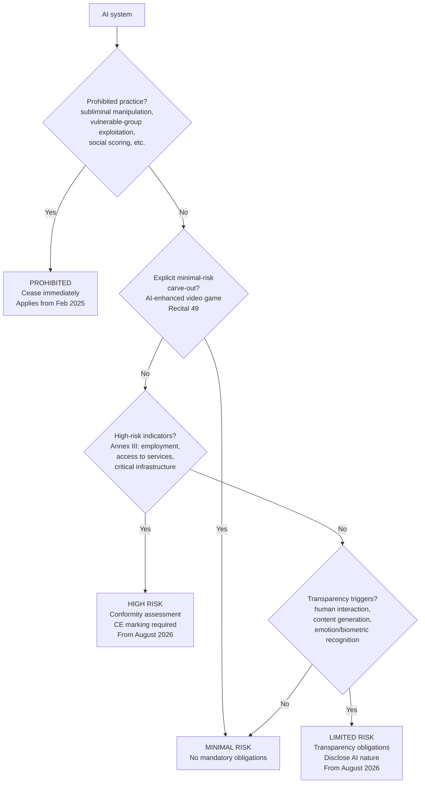

# CPLY-008: NIS2 & EU AI Act Applicability for Danish Startups (Gaming/Hosting Sector)

**Research ID:** CPLY-008  
**Status:** Complete  
**Last Updated:** 2026-04-13  
**Author:** CPLY research pass — sources: NIS2 Directive (EU) 2022/2555, EU AI Act (EU) 2024/1689, CFCS guidance, Erhvervsstyrelsen notices  
**Scope:** Exact applicability criteria (size thresholds, sector classifications, essential vs important, risk categories, SME exemptions, deployer vs provider) for Danish startups in the gaming and hosting sectors. Decision trees coded against the project's `Company` / `ApplicabilityCriteria` TypeScript types.

---

## Executive Summary

**NIS2** (Directive 2022/2555) expands EU cybersecurity obligations to medium/large entities in "essential" and "important" sectors. For gaming/hosting:

- **Hosting providers** operating cloud computing, data-centre, or CDN services are **essential entities under NIS2 regardless of company size** (size-threshold exception). A two-person startup running a cloud hosting product is in scope.
- **Gaming companies** typically fall under "digital providers" (online marketplaces, social networking) as **important entities** — but only if they meet the medium-enterprise size threshold (50+ employees or €10 M+ turnover).
- Personal liability for management is a distinguishing NIS2 feature; founders of in-scope companies are personally accountable.

**EU AI Act** (Regulation 2024/1689) uses a risk-based approach:

- **AI-enhanced video games** are explicitly cited as **minimal risk** in Recital 49 — no mandatory obligations.
- Chatbots, anti-cheat behavioural profiling, and AI-generated content carry **limited-risk transparency obligations**.
- AI used in recruitment, access to services, or critical infrastructure management is **high-risk** — full conformity assessment required before August 2026.
- **SMEs and startups** are not exempt from substantive requirements but benefit from reduced fees, national sandboxes, and proportionate enforcement.

---

## 1. NIS2 Directive (EU) 2022/2555

### 1.1 Regulatory Background

| Item | Detail |
|------|--------|
| Citation | Directive (EU) 2022/2555 |
| Entered into force | 16 January 2023 |
| Member-state transposition deadline | 17 October 2024 |
| Danish transposition | Lov om foranstaltninger til sikring af et højt cybersikkerhedsniveau (2024) |
| Primary enforcement authority (DK) | CFCS (Center for Cybersikkerhed) — under Forsvarsministeriet |
| Sector-specific co-authorities | Energistyrelsen (energy), Finanstilsynet (banking), Sundhedsstyrelsen (health) |

### 1.2 Sector Classification

NIS2 defines two entity tiers. The sector lists are **exhaustive** — entities not in Annex I/II are out of scope regardless of size.

#### Annex I — Essential Entities (stricter enforcement)

| # | Sector | Gaming/Hosting Relevance |
|---|--------|--------------------------|
| 1 | Energy (electricity, district heating, oil, gas, hydrogen) | — |
| 2 | Transport (air, rail, water, road) | — |
| 3 | Banking — credit institutions | — |
| 4 | Financial market infrastructure — trading venues, CCPs | — |
| 5 | Health — hospitals, pharma, medical devices, labs | — |
| 6 | Drinking water | — |
| 7 | Waste water | — |
| **8** | **Digital infrastructure** — IXPs, DNS service providers, TLD name registries, cloud computing service providers, data-centre services, CDN providers, trust service providers, electronic communications networks/services | **Hosting: directly in scope if operating cloud, CDN, or data-centre services** |
| **9** | **ICT service management (B2B)** — managed service providers (MSPs), managed security service providers (MSSPs) | **Hosting: directly in scope if providing managed IT services to other businesses** |
| 10 | Public administration | — |
| 11 | Space — ground-based infrastructure | — |

#### Annex II — Important Entities (lighter enforcement, same obligations)

| # | Sector | Gaming/Hosting Relevance |
|---|--------|--------------------------|
| 1 | Postal and courier services | — |
| 2 | Waste management | — |
| 3 | Chemicals | — |
| 4 | Food production/distribution | — |
| 5 | Manufacturing (medical devices, electronics, machinery, vehicles) | — |
| **6** | **Digital providers** — online marketplaces, online search engines, social-networking service providers | **Gaming: platforms with in-game marketplaces or social features may qualify** |
| 7 | Research organisations | — |

### 1.3 Size Thresholds

NIS2 uses the **EU SME definition** (Commission Recommendation 2003/361/EC):

| Enterprise size | Employees | AND/OR | Turnover | AND/OR | Balance sheet |
|----------------|-----------|--------|----------|--------|---------------|
| **Micro** | < 10 | | < €2 M | | < €2 M |
| **Small** | < 50 | | < €10 M | | < €10 M |
| **Medium** | < 250 | | ≤ €50 M | | ≤ €43 M |
| **Large** | ≥ 250 | | > €50 M | | > €43 M |

**NIS2 general scope**: Medium and large enterprises in Annex I/II sectors.

**Minimum threshold to be in scope (general rule)**:
- ≥ 50 employees **OR** annual turnover ≥ €10 M **OR** balance-sheet total ≥ €10 M

> **AND** operating in an Annex I or Annex II sector.

#### Critical Exception: Size-Regardless Entities

Certain entity types are in scope **regardless of size** (Art. 2(2)):

| Exception entity type | Why it matters for hosting startups |
|----------------------|--------------------------------------|
| DNS service providers | Any startup running authoritative DNS resolution |
| TLD name registries | Domain registrar / registry operators |
| Cloud computing service providers | **Any startup offering cloud hosting, IaaS, PaaS, SaaS infrastructure** |
| Data-centre service providers | Colocation, managed hosting |
| Content delivery network (CDN) providers | Edge caching, media delivery |
| Trust service providers (qualified) | Certificate authorities, e-signatures |
| Providers of public electronic communications networks or services | ISPs, VoIP |
| Sole provider of a service essential to society in a Member State | Rare; case-by-case |

> **Implication for gaming/hosting startups:** A three-person startup that sells cloud infrastructure (IaaS/PaaS) is an essential entity under NIS2 **from day one**, regardless of headcount or turnover. The common assumption that "small companies are exempt" does not apply here.

### 1.4 Essential vs Important — Practical Differences

| Dimension | Essential entity | Important entity |
|-----------|-----------------|-----------------|
| Enforcement approach | Proactive (ex-ante) supervision | Reactive (ex-post) supervision |
| Maximum fine | €10 M or **2%** of global annual turnover | €7 M or **1.4%** of global annual turnover |
| Incident reporting | Same (24 h / 72 h / 1 month) | Same |
| Risk-management obligations | Same (Art. 21) | Same |
| Management liability | Same | Same |
| Registration obligation | Yes | Yes |
| Regular audits by authority | Yes (proactive) | Only after incident / complaint |

### 1.5 Key Obligations (Art. 20–23)

1. **Risk-management measures (Art. 21)**
   - Risk analysis and information-security policies
   - Incident handling
   - Business continuity, backup management, disaster recovery
   - Supply-chain security (direct suppliers and service providers)
   - Security in network/system acquisition, development, and maintenance
   - Vulnerability handling and responsible disclosure
   - Cryptography and encryption policies
   - Human-resource security, access control, asset management
   - Multi-factor authentication (MFA) across all administrative access
   - Secure communications

2. **Incident reporting (Art. 23)**

   | Stage | Deadline | Content |
   |-------|----------|---------|
   | Early warning | **24 hours** after becoming aware | Incident occurred, whether attack suspected |
   | Notification | **72 hours** | Initial assessment: severity, indicators of compromise |
   | Progress report (if requested) | On request | Intermediary status |
   | Final report | **1 month** | Full description, root cause, mitigation, cross-border impact |

3. **Management accountability (Art. 20)**
   - Management body (board/directors) must approve cybersecurity risk measures
   - Must oversee implementation
   - Must undergo regular cybersecurity training
   - **Personal liability**: management members can be fined, named publicly, or temporarily banned from management roles

4. **Supply-chain security**
   - Contractual cybersecurity requirements with all critical suppliers
   - Assess risks posed by ICT service providers (cloud, SaaS)

### 1.6 Penalties

| Violation | Essential entity | Important entity |
|-----------|-----------------|-----------------|
| Non-compliance with risk measures | Up to €10 M or 2% global turnover | Up to €7 M or 1.4% global turnover |
| Non-compliance with incident reporting | Same | Same |
| Personal fine (management) | Possible | Possible |
| Public naming | Yes | Yes |
| Temporary management suspension | Yes | Yes |

---

## 2. EU AI Act (Regulation EU) 2024/1689

### 2.1 Regulatory Background

| Item | Detail |
|------|--------|
| Citation | Regulation (EU) 2024/1689 |
| Entered into force | 1 August 2024 |
| Danish supervisory authority | Erhvervsstyrelsen (Danish Business Authority) |
| GDPR intersection | Datatilsynet remains competent for AI processing personal data |
| EU coordination body | EU AI Office (European Commission) |

### 2.2 Enforcement Timeline

| Date | What takes effect |
|------|-------------------|
| 1 August 2024 | Regulation enters into force |
| **2 February 2025** | **Prohibited AI practices** (Art. 5, Chapter II) — already in force |
| **2 August 2025** | **GPAI model obligations** (Chapter V, Arts. 51–55); governance bodies established |
| **2 August 2026** | **High-risk AI** (Annex III) full obligations; **transparency obligations** (Art. 50); **limited-risk** rules |
| 2 August 2027 | High-risk AI embedded in regulated products (Annex I — medical devices, machinery, etc.) |

### 2.3 Risk-Based Classification

#### Tier 1 — Prohibited AI Practices (Art. 5) — **Already in force**

These practices must cease immediately:

| Prohibited practice | Gaming/Hosting relevance |
|--------------------|--------------------------|
| Subliminal manipulation causing harm (below awareness threshold) | Game mechanics designed to manipulate spending without player awareness — borderline; assess per design intent |
| Exploiting vulnerabilities of specific groups (age, disability, social situation) | Targeting children with manipulative monetisation AI — prohibited |
| Social scoring by public authorities | N/A (public authority only) |
| Real-time remote biometric identification in publicly accessible spaces (law enforcement) | N/A (law enforcement only) |
| Emotion recognition in workplace or educational institutions | Employee monitoring tools using emotion AI — prohibited |
| Biometric categorisation to infer race, political opinion, sexual orientation, religion | Profile enrichment AI — prohibited |
| Untargeted scraping of facial images for recognition databases | User-generated content analysis pipelines — assess carefully |
| Predictive policing based solely on profiling | N/A |

#### Tier 2 — High-Risk AI Systems (Annex III) — **From 2 August 2026**

Standalone AI systems in these areas require full conformity assessment:

| Category | Gaming/Hosting relevance |
|----------|--------------------------|
| Biometric identification and categorisation | Facial recognition for player identity verification |
| Safety components of critical infrastructure | Data-centre cooling/power management AI (hosting) |
| Educational/vocational training systems | AI tutoring products; game-based learning platforms |
| **Employment and worker management** — recruitment, performance evaluation, task allocation, termination | **HR tools, AI-driven hiring, contractor management** |
| **Access to essential private/public services** — creditworthiness, insurance, benefits | **Gaming: subscription-tier pricing AI using personal financial data** |
| Law enforcement | N/A |
| Migration and asylum | N/A |
| Administration of justice | N/A |

**Provider obligations for high-risk AI:**
- Risk management system (continuous lifecycle)
- Data governance and quality management
- Technical documentation (Annex IV format)
- Automatic logging / record-keeping
- Transparency information for deployers
- Human oversight mechanism in the design
- Accuracy, robustness, and cybersecurity requirements
- Conformity assessment (self-assessment or third-party)
- CE marking + EU declaration of conformity
- Registration in EU database

**Deployer obligations for high-risk AI:**
- Use only per instructions for use
- Qualified human oversight
- Monitor operation, report incidents
- DPIA where personal data involved

#### Tier 3 — Limited-Risk AI (Art. 50) — **From 2 August 2026**

Transparency obligations (must disclose AI nature):

| System type | Gaming/Hosting examples | Obligation |
|-------------|------------------------|------------|
| Conversational AI / chatbots | In-game support bots, onboarding assistants | Inform user they are interacting with AI |
| AI-generated content | Procedural level generation, AI-voiced NPCs, AI art | Label content as AI-generated if risk of being mistaken for human-made |
| Emotion recognition | Player emotion analysis (fatigue, frustration) | Inform person being assessed |
| Biometric categorisation | Player avatar analysis | Inform person being categorised |
| Deep fakes / synthetic media | AI character voices, video generation | Label as AI-generated |

#### Tier 4 — Minimal Risk — No mandatory obligations

> **Recital 49** of the AI Act explicitly states: *"AI systems used for narrow purposes such as AI-enhanced video games or spam filters… should not be covered by this Regulation as high-risk AI systems."*

| System type | Examples |
|-------------|---------|
| **AI-enhanced video games** | **Matchmaking, NPC behaviour, adaptive difficulty, procedural generation** — **explicitly minimal risk per Recital 49** |
| Spam/content filters | Anti-spam in game chat, email filtering |
| AI in productivity tools | Code completion, drafting tools used internally |
| Recommendation systems (non-Annex III) | Game recommendations, related content, discovery feeds |
| Anti-cheat detection (non-biometric) | Pattern-based cheat detection without biometric data |

### 2.4 Provider vs Deployer Distinction

| Role | Definition | Primary obligations |
|------|-----------|---------------------|
| **Provider** | Develops an AI system and places it on the market or puts it into service under own name/trademark — including for own internal use when training on own data | Conformity assessment, CE marking, technical documentation, post-market monitoring, registration |
| **Deployer** | Uses an AI system in a professional context under their authority (not personal use) | Human oversight, data governance, transparency to affected persons, incident reporting |
| **Importer** | Brings a non-EU provider's AI system into the EU market | Verify provider compliance, maintain documentation |
| **Distributor** | Makes an AI system available on the market without modifying it | Verify CE marking, cooperate with authorities |

**Key rule**: If you **fine-tune** or **significantly modify** a third-party AI model and deploy it under your name, you become the **provider** — not the deployer — with full provider obligations.

**Gaming/Hosting examples:**

| Scenario | Role | Obligations |
|----------|------|-------------|
| Using OpenAI/Anthropic API for a chatbot | Deployer | Transparency (disclose AI to user); not responsible for GPAI model compliance |
| Building own matchmaking ML model | Provider (if placed on market) or Deployer (internal use only) | Internal: deployer; if licensed to other games: provider obligations |
| Fine-tuning LLaMA for in-game NPC dialogue and selling access | Provider | Full provider obligations apply |
| Using Microsoft Copilot internally for dev team | Deployer (minimal risk) | No specific obligations |
| Offering AI-powered hosting analytics SaaS | Provider (limited or high risk depending on use) | Assess risk tier; transparency at minimum |

### 2.5 General-Purpose AI (GPAI) Models (Arts. 51–55) — **From 2 August 2025**

| Criterion | Detail |
|-----------|--------|
| What qualifies | Models trained on broad data at scale (e.g. GPT-4, Claude, Gemini) with significant general capabilities |
| Systemic risk threshold | Training compute > 10²⁵ FLOPs (Art. 51(2)) |
| Standard GPAI obligations | Technical documentation, copyright compliance policy, training data summary |
| Systemic risk GPAI additional obligations | Adversarial testing, incident reporting, cybersecurity, energy reporting |
| Relevance for startups | If you are a **user** of GPAI APIs: deployer obligations only. If you **train/fine-tune** a GPAI model for commercial release: provider obligations |

### 2.6 SME & Startup Exemptions

SMEs do **not** have a blanket exemption from substantive requirements, but benefit from:

| Benefit | Detail |
|---------|--------|
| Reduced conformity assessment fees | Proportional fee reduction for small/micro enterprises |
| National regulatory sandboxes | Controlled testing environments without full compliance burden; Denmark's sandbox via Erhvervsstyrelsen (expected 2025/2026) |
| Simplified technical documentation | Reduced Annex IV documentation requirements for certain high-risk systems |
| Priority access to AI office guidance | SMEs get targeted guidance and Q&A support |
| Proportionate enforcement | Authorities must consider company size when determining fines |
| Extended compliance support | Member states must provide dedicated SME support (training, information, access to testing) |

---

## 3. Decision Trees for Implementation

These decision trees are designed to be directly translated into the project's `Company` and `ApplicabilityCriteria` TypeScript types.

### 3.1 NIS2 Applicability Decision Tree

```
NIS2_ESSENTIAL_SECTORS = [
  'cloud_computing', 'data_centre', 'cdn', 'dns_provider', 'tld_registry',
  'isp', 'trust_service', 'ixp', 'msp', 'mssp',         // Annex I §8-9
  'energy', 'transport', 'banking', 'financial_market',
  'health', 'drinking_water', 'wastewater', 'public_admin', 'space'
]

NIS2_IMPORTANT_SECTORS = [
  'online_marketplace', 'online_search_engine', 'social_network', // Annex II §6
  'postal', 'waste_management', 'chemicals', 'food',
  'manufacturing_medtech', 'manufacturing_electronics',
  'manufacturing_machinery', 'manufacturing_vehicles', 'research'
]

// Entities exempt from size threshold — in scope regardless of employee count / turnover
NIS2_SIZE_REGARDLESS_ENTITIES = [
  'dns_provider', 'tld_registry', 'cloud_computing', 'data_centre',
  'cdn', 'trust_service', 'isp'
]

function assessNIS2(company: Company): NIS2Assessment {
  const sector = company.industry_sector

  // Step 1: Check size-regardless exceptions (Art. 2(2))
  if (NIS2_SIZE_REGARDLESS_ENTITIES.includes(sector)) {
    return {
      applicable: true,
      category: 'essential',
      reason: 'Digital infrastructure provider — in scope regardless of size'
    }
  }

  // Step 2: Size threshold check
  const meetsSize =
    (company.employee_count ?? 0) >= 50 ||
    (company.annual_turnover_eur ?? 0) >= 10_000_000

  if (!meetsSize) {
    return { applicable: false, reason: 'Below medium-enterprise threshold' }
  }

  // Step 3: Sector classification
  if (NIS2_ESSENTIAL_SECTORS.includes(sector)) {
    return { applicable: true, category: 'essential' }
  }
  if (NIS2_IMPORTANT_SECTORS.includes(sector)) {
    return { applicable: true, category: 'important' }
  }

  return { applicable: false, reason: 'Sector not in NIS2 Annex I/II' }
}
```

**Mermaid decision tree:**



### 3.2 EU AI Act Risk Classification Decision Tree

```typescript
type AIRiskTier = 'prohibited' | 'high' | 'limited' | 'minimal'

interface AISystemProfile {
  purpose: string
  hasHumanInteraction: boolean
  generatesContent: boolean
  usesEmotionRecognition: boolean
  usesBiometrics: boolean
  affectsEmploymentDecisions: boolean
  affectsAccessToServices: boolean
  affectsCriticalInfrastructure: boolean
  usesSubliminalTechniques: boolean
  exploitsVulnerableGroups: boolean
  isVideoGameAI: boolean       // explicit Recital 49 carve-out
}

// Prohibited practices (Art. 5) — checked first, in force from Feb 2025
const PROHIBITED_INDICATORS = [
  'usesSubliminalTechniques',
  'exploitsVulnerableGroups',
  'socialScoringByPublicAuthority',
  'realtimeBiometricLawEnforcement',
  'emotionRecognitionWorkplace',
  'biometricCategorizationSensitiveAttributes',
  'untargetedFaceScraping',
  'predictivePolicingProfiling'
] as const

function classifyAIRisk(ai: AISystemProfile): AIRiskTier {
  // Step 1: Prohibited? (Art. 5)
  if (ai.usesSubliminalTechniques || ai.exploitsVulnerableGroups) {
    return 'prohibited'
  }

  // Step 2: Minimal risk explicit carve-out (Recital 49)
  if (ai.isVideoGameAI && !ai.affectsEmploymentDecisions && !ai.usesBiometrics) {
    return 'minimal'
  }

  // Step 3: High risk? (Annex III)
  if (
    ai.affectsEmploymentDecisions ||
    ai.affectsAccessToServices ||
    ai.affectsCriticalInfrastructure
  ) {
    return 'high'
  }

  // Step 4: Limited risk? (Art. 50)
  if (
    ai.hasHumanInteraction ||
    ai.generatesContent ||
    ai.usesEmotionRecognition ||
    ai.usesBiometrics
  ) {
    return 'limited'
  }

  // Step 5: Minimal — no obligations
  return 'minimal'
}
```

**Mermaid decision tree:**



### 3.3 Provider vs Deployer Determination

```typescript
type AIStakeholderRole = 'provider' | 'deployer' | 'importer' | 'distributor' | 'out_of_scope'

interface AIUsageProfile {
  developedInHouse: boolean
  fineTunedExternalModel: boolean       // fine-tuning = becomes provider
  placedOnMarketUnderOwnBrand: boolean
  usesThirdPartyAPIUnmodified: boolean  // API usage = deployer
  importedFromNonEU: boolean
  distributesWithoutModification: boolean
  professionalContext: boolean          // personal use = out of scope
}

function determineAIRole(profile: AIUsageProfile): AIStakeholderRole {
  if (!profile.professionalContext) return 'out_of_scope'

  if (profile.developedInHouse || profile.fineTunedExternalModel) {
    if (profile.placedOnMarketUnderOwnBrand) return 'provider'
    // Internal deployment only — still provider if trained on own data for own use
    return 'provider'
  }

  if (profile.importedFromNonEU) return 'importer'
  if (profile.distributesWithoutModification) return 'distributor'
  if (profile.usesThirdPartyAPIUnmodified) return 'deployer'

  return 'deployer'  // Default for professional AI users
}
```

### 3.4 ApplicabilityCriteria Seed Values

These values should be used when seeding the `regulations` table for NIS2 and AI Act records (matches `ApplicabilityCriteria` type in `src/types/assessment.ts`):

```typescript
// NIS2 applicability criteria seed
const nis2ApplicabilityCriteria: ApplicabilityCriteria = {
  default_applicable: false,
  sectors: [
    // Essential (Annex I)
    'cloud_computing', 'data_centre', 'cdn', 'dns_provider', 'tld_registry',
    'isp', 'trust_service', 'ixp', 'msp', 'mssp',
    'energy', 'transport', 'banking', 'financial_market_infrastructure',
    'health', 'drinking_water', 'wastewater', 'public_administration', 'space',
    // Important (Annex II)
    'online_marketplace', 'online_search_engine', 'social_network',
    'postal_courier', 'waste_management', 'chemicals', 'food_production',
    'manufacturing_medtech', 'manufacturing_electronics',
    'manufacturing_machinery', 'manufacturing_vehicles', 'research'
  ],
  min_employees: 50,              // General threshold; exception entities bypass this
  requires_personal_data_processing: false,
  requires_digital_services: false,
  requires_payment_processing: false,
  requires_financial_services: false,
  requires_ai_systems: false,
  requires_critical_infrastructure: true,  // has_critical_infrastructure flag in Company
  requires_employees: false,
  description_en: 'Applies to medium/large entities in essential/important sectors. Cloud/CDN/data-centre providers are in scope regardless of size.',
  description_da: 'Gælder for mellemstore/store virksomheder i væsentlige/vigtige sektorer. Cloud/CDN/datacenterudbydere er omfattet uanset størrelse.'
}

// EU AI Act applicability criteria seed
const aiActApplicabilityCriteria: ApplicabilityCriteria = {
  default_applicable: false,
  sectors: ['*'],  // Applies to all sectors — triggered by AI system usage
  min_employees: 0,
  requires_personal_data_processing: false,
  requires_digital_services: false,
  requires_payment_processing: false,
  requires_financial_services: false,
  requires_ai_systems: true,       // uses_ai_systems flag in Company
  requires_critical_infrastructure: false,
  requires_employees: false,
  description_en: 'Applies to any company that develops (provider) or uses (deployer) AI systems in a professional context in the EU.',
  description_da: 'Gælder for enhver virksomhed, der udvikler (udbyder) eller anvender (bruger) AI-systemer i en professionel sammenhæng i EU.'
}
```

---

## 4. Gaming/Hosting Sector Reference Table

| Company type | NIS2 scope | NIS2 category | AI Act role (typical) | AI Act tier (typical) |
|--------------|-----------|--------------|----------------------|----------------------|
| Cloud IaaS/PaaS provider | **Yes — size-regardless** | Essential | Provider or Deployer | Varies by AI feature |
| Managed hosting (VPS, dedicated) | **Yes — size-regardless** | Essential | Deployer (if using AI tools) | Limited/Minimal |
| CDN provider | **Yes — size-regardless** | Essential | Deployer | Minimal |
| DNS service provider | **Yes — size-regardless** | Essential | Deployer | Minimal |
| Game studio (AAA/mid) ≥50 employees | Yes (if online marketplace/social) | Important | Provider (own AI) or Deployer | Minimal (Recital 49) |
| Game studio (indie) <50 employees | **No** (size exempt, no exception) | — | Provider/Deployer | Minimal (Recital 49) |
| Gaming platform with marketplace | Yes if ≥50 employees | Important | Provider/Deployer | Limited (chatbots) |
| MSP / MSSP | **Yes — size-regardless** | Essential | Deployer | Varies |
| SaaS startup (non-hosting) | Only if ≥50 employees and in scope sector | Important (if digital provider) | Provider | Limited/High depending on use |

---

## 5. Danish Regulatory Authority Map

| Regulation | Primary DK authority | Key contact / resource |
|------------|---------------------|------------------------|
| NIS2 — digital infrastructure | CFCS (Center for Cybersikkerhed) | cfcs.dk/cybersikkerhed/nis2 |
| NIS2 — energy sector | Energistyrelsen | ens.dk |
| NIS2 — financial sector | Finanstilsynet | finanstilsynet.dk |
| NIS2 — health sector | Sundhedsstyrelsen | sst.dk |
| EU AI Act | Erhvervsstyrelsen | erhvervsstyrelsen.dk/ai-act |
| GDPR (intersects AI Act) | Datatilsynet | datatilsynet.dk |
| Bogføringsloven (cross-cutting) | Erhvervsstyrelsen | erhvervsstyrelsen.dk |
| Whistleblower Act | Datatilsynet | datatilsynet.dk |

---

## 6. Actionable Checklist for Danish Gaming/Hosting Startups

### NIS2 Readiness

- [ ] Map your services to NIS2 Annex I/II sector list
- [ ] Determine if you are a size-regardless entity (cloud/CDN/DNS/data-centre/ISP/trust)
- [ ] If not size-regardless: count FTE employees and calculate annual turnover (€)
- [ ] Register with relevant authority (CFCS / sector authority) if in scope
- [ ] Adopt ISO 27001 or equivalent risk-management framework (>80% overlap with NIS2 Art. 21)
- [ ] Build 24-hour early-warning incident response capability
- [ ] Implement MFA across all administrative access
- [ ] Draft supply-chain security requirements for critical ICT suppliers
- [ ] Ensure board/management completes cybersecurity awareness training
- [ ] Review personal liability implications with legal counsel

### EU AI Act Compliance

- [ ] Inventory every AI system used (dev tools, third-party APIs, own models)
- [ ] For each system: apply risk classification (prohibited → high → limited → minimal)
- [ ] Check Recital 49: game AI is minimal risk — document this decision
- [ ] Check prohibited practices: cease any system matching Art. 5 criteria immediately
- [ ] For chatbots/AI-generated content: implement user disclosure by August 2026
- [ ] For HR/recruitment AI: plan conformity assessment ahead of August 2026
- [ ] Determine provider vs deployer role for each system
- [ ] If provider: prepare technical documentation, logging, human oversight design
- [ ] Explore Erhvervsstyrelsen regulatory sandbox for novel AI use cases
- [ ] Document rationale for all risk classifications (audit trail)

### Cross-Cutting

- [ ] Appoint named compliance owner for NIS2 + AI Act
- [ ] Add cybersecurity and AI compliance clauses to supplier/customer contracts
- [ ] Schedule annual applicability review (size thresholds change as you grow)
- [ ] Maintain records for authority inspections

---

## 7. Sources

### NIS2
- **Directive (EU) 2022/2555 (NIS2)** — EUR-Lex full text: https://eur-lex.europa.eu/eli/dir/2022/2555/oj
- **CFCS — NIS2 guidance (DK)**: https://cfcs.dk/cybersikkerhed/nis2
- **European Commission NIS2 factsheet**: https://digital-strategy.ec.europa.eu/en/library/nis2-directive
- **Danish transposition law**: Lov om foranstaltninger til sikring af et højt cybersikkerhedsniveau (Forsvarsministeriet, 2024)
- **EU SME definition**: Commission Recommendation 2003/361/EC

### EU AI Act
- **Regulation (EU) 2024/1689 (AI Act)** — EUR-Lex full text: https://eur-lex.europa.eu/eli/reg/2024/1689/oj
- **Recital 49 (minimal-risk video games)**: Regulation (EU) 2024/1689, Recital 49
- **European Commission AI Act portal**: https://digital-strategy.ec.europa.eu/en/policies/european-ai-act
- **Erhvervsstyrelsen AI Act guidance**: https://erhvervsstyrelsen.dk/ai-act
- **EU AI Office**: https://digital-strategy.ec.europa.eu/en/policies/ai-office

### Danish Context
- **Datatilsynet** (GDPR / AI Act personal data): https://www.datatilsynet.dk
- **Erhvervsstyrelsen** (AI Act, Bogføringsloven): https://erhvervsstyrelsen.dk
- **CFCS** (cybersecurity / NIS2): https://cfcs.dk

---

*Prepared for CPLY-008 — EUComply decision-tree implementation.*  
*Next steps: Integrate `assessNIS2()` and `classifyAIRisk()` logic into the classifier prompt and onboarding flow sector-mapping.*
